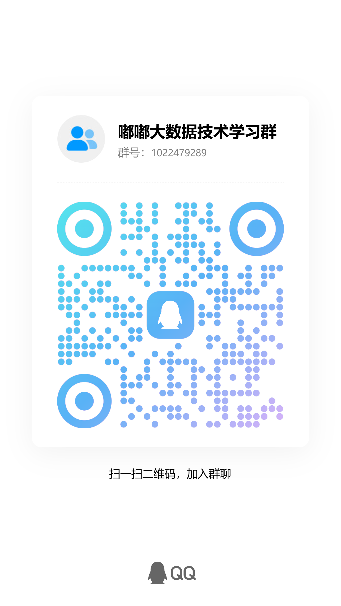

# duduAI Stock

面向 A 股研究与交易辅助的多智能体投研系统。项目基于 Streamlit 构建 Web 界面，结合 OpenAI 兼容大模型、A 股行情/财务/新闻/资金流数据，为个人投资者提供选股、策略分析、龙虎榜研判、新闻流量监测、持仓复盘和实时盯盘等工具。

> 本项目只提供数据整理、策略研究和辅助分析能力，不构成任何投资建议。股市有风险，入市需谨慎。

## 项目定位

duduAI Stock 的目标不是替代投资决策，而是把分散的数据源、策略规则和 AI 分析流程整合到一个本地化工作台中，帮助用户更高效地完成：

- 股票基础面、技术面、资金面、新闻面综合分析
- 多智能体投研报告生成
- A 股策略选股与结果跟踪
- 龙虎榜与游资行为分析
- 新闻热点到行业/个股影响的映射
- 持仓组合复盘、风险提示和监控提醒

系统默认支持 DeepSeek，也可以切换到其他 OpenAI 兼容模型，例如通义千问、GPT 系列或私有部署模型。

## 核心功能

### 单股 AI 分析

- 股票基础信息、行情走势、技术指标展示
- 技术分析、基本面分析、资金流分析、风险控制等多角色分析
- 分析师团队讨论与最终投资决策摘要
- 支持单股分析、批量分析、历史记录查看

### 策略选股

- 主力选股：围绕主力资金、成交活跃度和趋势结构进行筛选
- 低价擒牛：面向低价、高成长、趋势改善类标的
- 小市值策略：关注小盘高成长股票池
- 净利增长：筛选净利润增长稳定的公司
- 低估值策略：结合低 PE、低 PB、高股息、低负债等价值因子
- CANSLIM 与形态识别：结合成长、趋势和技术形态做候选池分析

### 策略分析

- 智策板块：面向行业板块的 AI 策略研判
- 智囊团游资龙虎榜：龙虎榜数据、游资行为、席位风格和短线潜力分析
- 新闻流量：监测热点新闻，分析对 A 股行业和个股的可能影响
- 宏观分析：结合宏观数据、政策环境和 A 股行业映射
- 宏观周期：康波周期、美林投资时钟、中国政策环境等框架分析
- 共性追踪：跟踪多轮选股结果中的技术、行业、资金和形态共性

### 投资管理与监控

- 持仓分析：组合视角下的个股表现、风险和调整建议
- AI 盯盘：面向 A 股 T+1 场景的自动盯盘和决策辅助
- 实时监测：价格、技术信号、策略持仓和提醒管理
- 支持邮件、Webhook、钉钉/飞书等通知配置

### 报告与本地化

- 支持 PDF/Markdown 报告生成
- 历史分析记录本地保存
- 菜单显示可配置
- 支持隐私显示设置，便于截图、演示和分享
- 支持 Docker 部署和本地 Python 环境运行

## 技术栈

- Python 3.10 - 3.12
- Streamlit
- Pandas / NumPy
- Plotly
- AkShare / Tushare / yfinance
- OpenAI SDK 兼容接口
- ReportLab
- Peewee / SQLite
- pydantic-settings

## 快速开始

### 1. 克隆项目

```bash
git clone https://github.com/BiomancerGame/dudu-ai-stock.git
cd duduAI-stock
```

### 2. 创建虚拟环境

```bash
python -m venv venv
```

Windows:

```bash
venv\Scripts\activate
```

macOS / Linux:

```bash
source venv/bin/activate
```

### 3. 安装依赖

```bash
pip install -r requirements.txt
```

### 4. 配置环境变量

复制环境变量模板：

```bash
cp .env.example .env
```

Windows PowerShell:

```powershell
Copy-Item .env.example .env
```

至少需要配置：

```env
DEEPSEEK_API_KEY=你的 DeepSeek API Key
DEEPSEEK_BASE_URL=https://api.deepseek.com/v1
DEFAULT_MODEL_NAME=deepseek-chat
```

如果使用其他 OpenAI 兼容模型，可以修改：

```env
DEEPSEEK_BASE_URL=https://你的模型服务地址/v1
DEFAULT_MODEL_NAME=你的模型名称
```

可选配置：

- `TUSHARE_TOKEN`：用于补充金融数据
- `IWENCAI_API_KEY`：用于问财 OpenAPI 数据能力
- `TDX_BASE_URL`：用于实时行情和策略监控
- `MINIQMT_*`：用于 MiniQMT 相关接口
- `EMAIL_*` / `WEBHOOK_*`：用于通知提醒

### 5. 启动应用

```bash
streamlit run app.py
```

或使用启动脚本：

```bash
python run.py
```

默认访问地址通常为：

```text
http://localhost:8501
```

`run.py` 脚本默认使用：

```text
http://127.0.0.1:8503
```

## Docker 部署

项目提供 `Dockerfile` 和 `docker-compose.yml`，可用于容器化部署。

```bash
docker compose up -d
```

部署前请确认 `.env` 已配置完成，并且不要把真实 `.env` 文件提交到 GitHub。

更多部署说明可参考：

- `docs/DOCKER_README.md`
- `docs/DOCKER_DEPLOYMENT.md`
- `BUILD_CN.md`

## 数据源说明

项目会根据功能模块调用不同数据源，包括但不限于：

- AkShare
- Tushare
- yfinance
- 问财 OpenAPI
- TDX API
- 新闻与公告数据源
- 本地 SQLite 历史记录

部分数据源可能受网络、接口频率、第三方服务变更影响。若出现数据为空、接口失败或字段变化，请优先检查网络、API Key、接口可用性和依赖版本。

## 目录结构

```text
.
├── app.py                    # Streamlit 主入口
├── ai_agents.py              # 多智能体分析流程
├── config.py                 # 兼容旧代码的配置入口
├── core/                     # 通用配置、日志、数据缓存等基础能力
├── services/                 # 分析服务封装
├── ui/                       # 菜单与页面组件
├── prompts/                  # 各类 AI 分析提示词
├── docs/                     # 使用文档与功能说明
├── tests/                    # 测试用例
├── requirements.txt          # 运行依赖
├── pyproject.toml            # 项目元数据与开发工具配置
└── Dockerfile                # Docker 构建文件
```

## 发布前注意事项

上传到 GitHub 前，请确认以下文件不要提交：

- `.env`
- `*.db`
- `data/`
- `logs/`
- `.pytest_cache/`
- `__pycache__/`
- `.streamlit/credentials.toml`
- `.streamlit/menu_config.json`
- 任何包含真实 API Key、Token、账号密码、Webhook 地址的文件

建议发布前执行：

```bash
git status --short
git diff --check
python -m py_compile app.py ai_agents.py
```

如需运行测试：

```bash
python -m pytest
```

注意：部分集成测试依赖外部行情服务、TDX 服务或 API Key，本地环境未配置时可能会跳过或失败。

## 免责声明

本项目仅用于技术研究、量化学习、数据整理和投研辅助。项目输出内容来自公开数据、第三方数据接口和大模型生成结果，可能存在延迟、错误、遗漏或解释偏差。

请勿将本项目输出直接作为买卖依据。任何投资决策均应由使用者独立判断并自行承担风险。项目作者和贡献者不对使用本项目造成的任何投资损失承担责任。

## 交流与反馈

如需交流使用问题、功能建议或二次开发，可通过以下方式联系：

- QQ：1431620471
- QQ 群：1022479289



## 致谢

本项目受多智能体投研系统和开源量化社区启发，感谢相关开源项目、数据服务和社区资料提供的参考。
